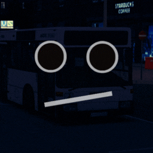
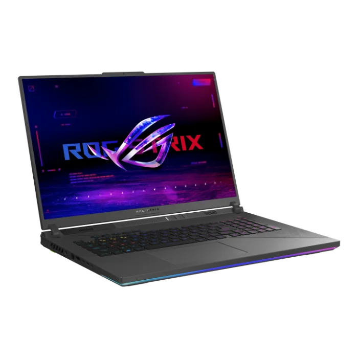
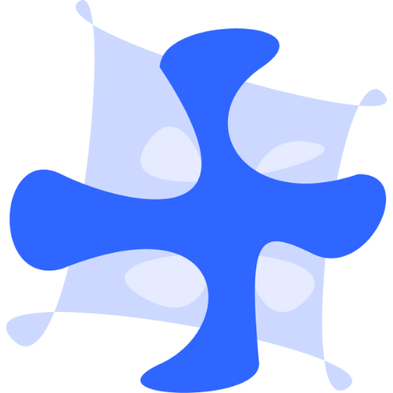
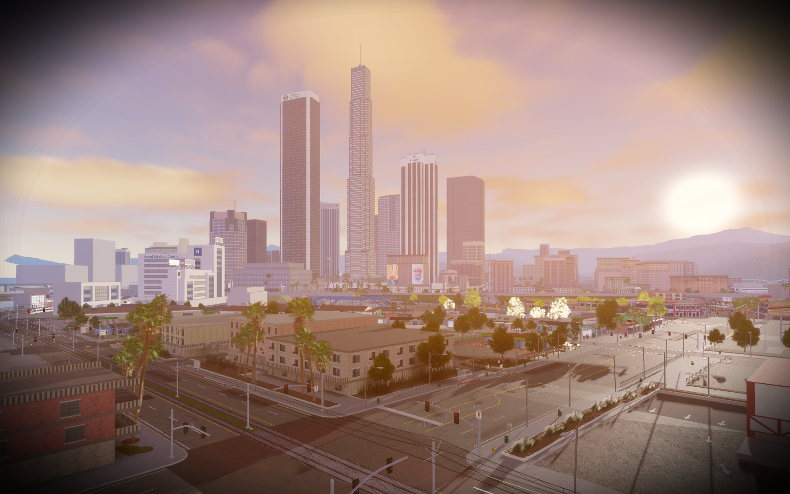

 

<table border="0" cellspacing="0" cellpadding="0"><tr>
<td></td>
<td></td>
</tr></table>

Coding...Scripting...Designing...UI...UX...Been through all...

 
 

## Coding/Languages

 

 

## Technologies/Software

 

 

 

## Hardware/Tools

 

## Setup

**ASUS ROG Strix G18** · `G814JIR-N6013W`

 

 

## Projects

 

###  Ink-ls &nbsp; 

Platform for hosting local LLMs.

| Component | Stack |
| :---: | :---: |
|  Site | `Python` `FastAPI` `HTML` `CSS` `JavaScript` `PostgreSQL` `Linux` |
|  Site — Relay | `Rust` |
|  Ink Host | `Rust` `Tauri` |
|  Ink Client | `Rust` `Tauri` |

 
 

###  Ink-Chat

Platform for chatting. Peer to peer voice calls.

`Rust` `Tauri` `TypeScript` `Python` `Flask` `HTML` `CSS` `Java`

 

###  Ink-AI

LLM hosted on my domain.

`Python` `Flask` `Ollama` `HTML` `CSS`

 

## Other Projects

### LS (Lost Sanches)

Open world game. Explore the main city and the countryside with various activities.

`Lua`

 

 

