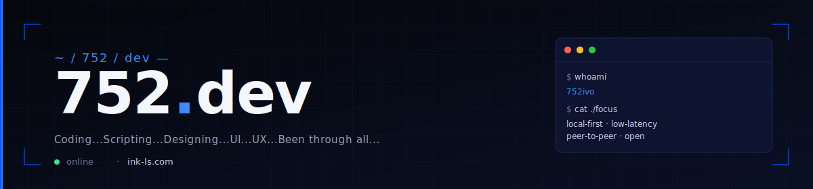
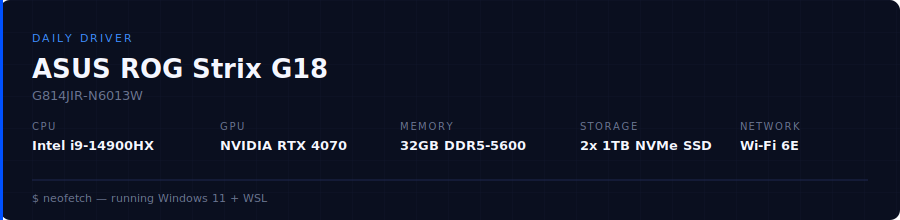

<a href="https://ink-ls.com">&nbsp;</a>

 
 

 

##  &nbsp; Coding / Languages

 
 

**Usage breakdown**

 

 
 

 

##  &nbsp; Technologies / Software

 

 

 

 
 

 

##  &nbsp; Hardware / Tools

 
 

 

##  &nbsp; Setup

 
 

**ASUS ROG Strix G18** &nbsp;·&nbsp; `G814JIR-N6013W`

 

 
 

 

##  &nbsp; Projects

 

###  &nbsp; Ink-ls

Platform for hosting local LLMs.

<table align="center">
<thead>
<tr><th>Component</th><th>Stack</th></tr>
</thead>
<tbody>
<tr>
<td align="center"> &nbsp; Site</td>
<td><code>Python</code> <code>FastAPI</code> <code>HTML</code> <code>CSS</code> <code>JavaScript</code> <code>PostgreSQL</code> <code>Linux</code></td>
</tr>
<tr>
<td align="center"> &nbsp; Site — Relay</td>
<td><code>Rust</code></td>
</tr>
<tr>
<td align="center"> &nbsp; Ink Host</td>
<td><code>Rust</code> <code>Tauri</code></td>
</tr>
<tr>
<td align="center"> &nbsp; Ink Client</td>
<td><code>Rust</code> <code>Tauri</code></td>
</tr>
</tbody>
</table>

 
 

###  &nbsp; Ink-Chat

Platform for chatting. Peer to peer voice calls.

`Rust` `Tauri` `TypeScript` `Python` `Flask` `HTML` `CSS`

 

###  &nbsp; Ink-AI

LLM hosted on my domain.

`Python` `Flask` `Ollama` `HTML` `CSS`

 
 

 

##  &nbsp; Other Projects

### LS (Lost Sanches)

Open world game. Explore the main city and the countryside with various activities.

`Lua`

 

 
 

 

<b>752.dev</b> &nbsp;·&nbsp; <a href="https://ink-ls.com">ink-ls.com</a>

 

